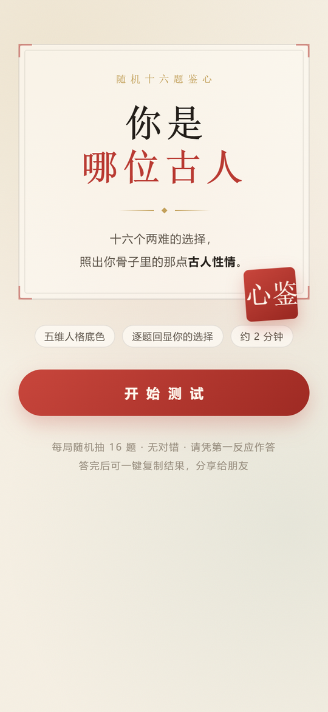
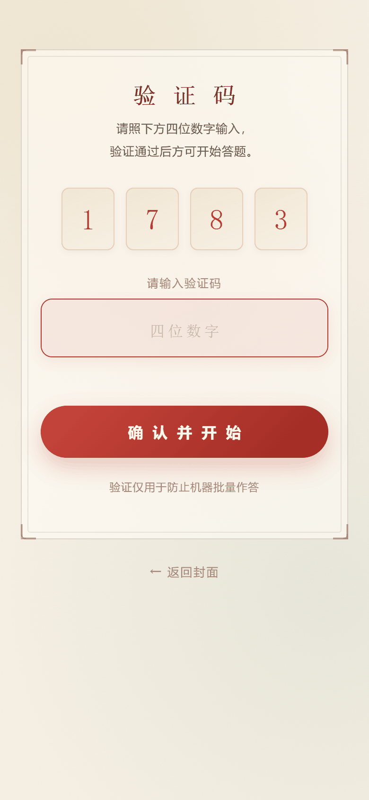
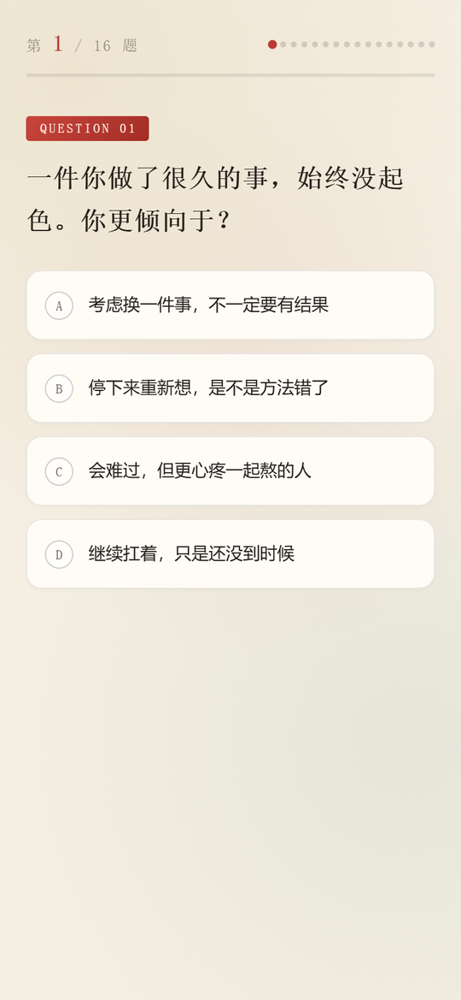
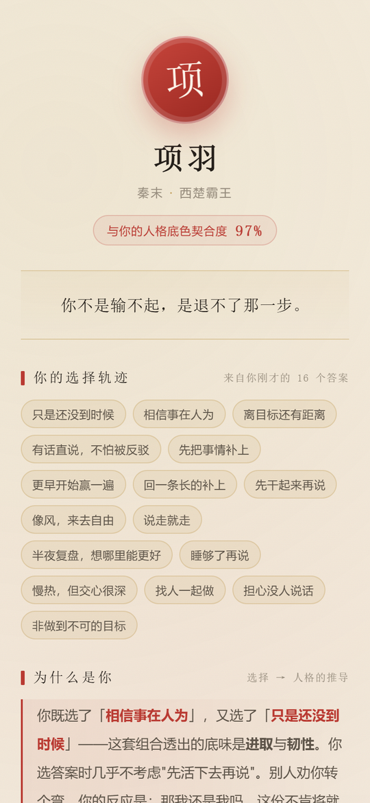
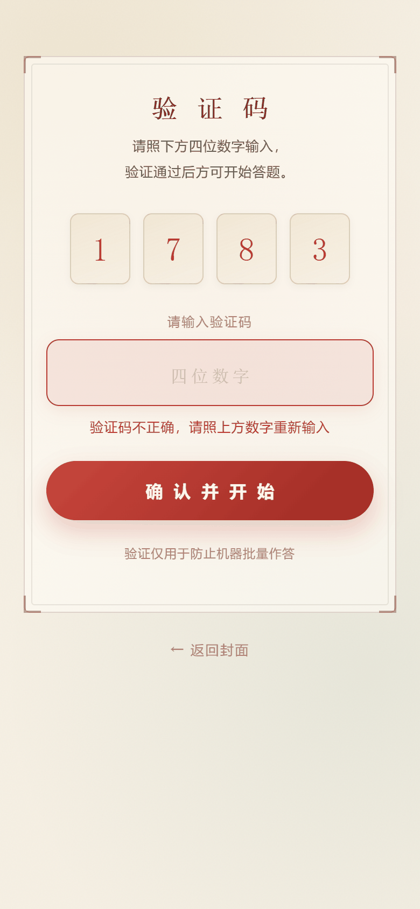
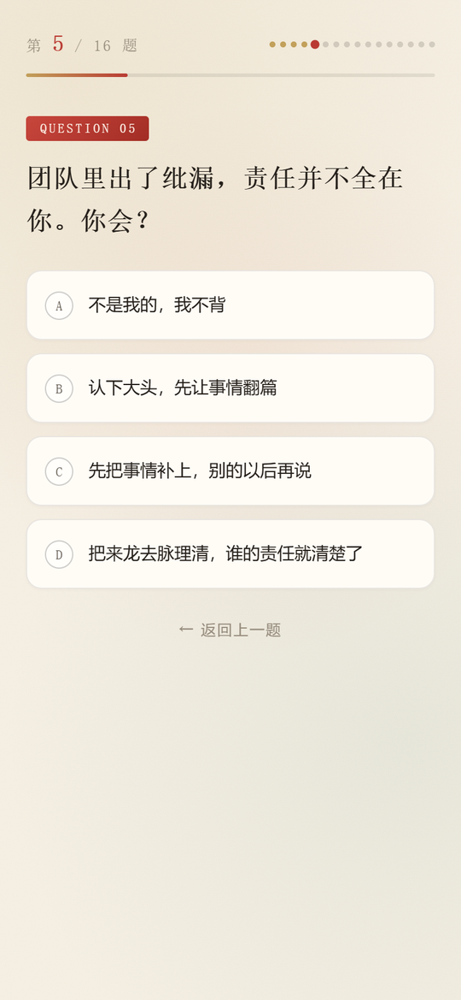
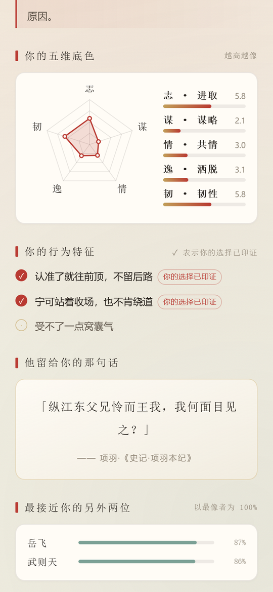
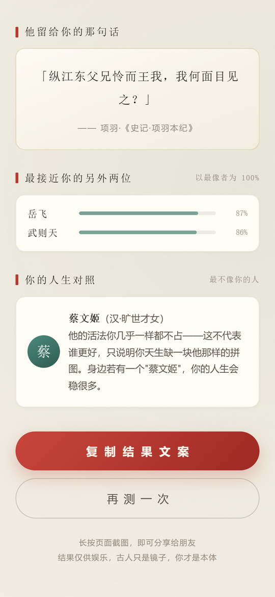

# 你是哪位古人 · 三十二题随机鉴心

> 一个国风人格测试 H5。32 题题库，**每次测试随机抽 16 题**，五维人格向量，测出你与 **23 位古人**中的哪一位最像。

**单文件 · 零依赖 · 可离线 · 双击即开**

🔗 **在线体验**：<https://1873402746.github.io/guofeng-identity-h5/>

---

## 预览

| 封面 | 验证码 | 答题 | 结果页 |
|:---:|:---:|:---:|:---:|
|  |  |  |  |

<details>
<summary>展开查看验证码错误提示、选项选中高亮、结果页中段与下半部分</summary>

| 验证码错误 | 选项选中高亮 | 结果页中段 | 结果页下半部分 |
|:---:|:---:|:---:|:---:|
|  |  |  |  |

</details>

---

## 功能一览

| 功能 | 说明 |
|---|---|
| **23 位古人** | 先秦 → 明，每人一套五维指纹、一句判词、三条行为特征、一句**逐条核验过出处**的名言。所有人物的指纹都由同一套可达性求解器产出，不是手写填数 |
| **32 题题库 · 每轮随机抽 16 题** | 每次进入测试从题库随机抽题，题序与选项顺序同时打乱，两次遇到的卷子几乎不重样（实测两轮平均重合约 8/16） |
| **验证码闸门（一次即可）** | 固定码（不显示在页面上，仅站点所有者知晓）；首次进入答题前校验，错误时输入框抖动并阻止进入；通过之后答题、再测一次都不再要求输入，只有重新打开页面才需要再输 |
| **选项选中静态高亮** | 选中项朱砂描边 + 浅红底 + 实心字母徽标，无过渡动画，点击后 240ms 即进下一题，反馈直接 |
| **四层选择回显** | 每句评价都能倒推到原始作答，不是泛泛的性格描述 |
| **一键分享文案** | 生成含结果、人格底色、选择轨迹的纯文本，方便粘贴 |
| **零外部请求** | 无 CDN、无字体外链、无图片文件，雷达图/印章全部内联 SVG / CSS |

---

## 为什么结果"像你"——评价与所选题目高度对应

普通测试只给你一个结论，这个项目做了四层**选择回显**，让每句评价都能倒推到你的原始作答：

| 机制 | 说明 |
|---|---|
| **① 选择轨迹** | 把你 16 道题的原始选项标签逐条列出，不是泛泛的性格描述 |
| **② 为什么是你** | 算法定位你得分最高的两维，反查你**具体选了哪两项**，把原文嵌进推导句 |
| **③ 行为特征印证** | 你的选择印证过的特征自动盖上「你的选择已印证」徽章，未印证的只留一个空心圆点，不硬凑 |
| **④ 五维雷达同框** | 你的分数与该古人的标准指纹在同一张雷达图上对比，差距一目了然 |

推导句示例（真实拼接，非模板套词）：

> 你既选了 **约时间当面聊**，又选了 **很多人的树洞**——这套组合透出的底味是进取与共情。你的答案里反复出现同一种姿态：明知代价，仍然选择。这不是固执，是你把"对"看得比"赢"重——这正是他在江边站到最后的原因。

---

## 五维人格模型

| 维度 | 含义 |
|---|---|
| **志** | 进取心与目标感 |
| **谋** | 谋略与思辨 |
| **情** | 共情与情感浓度 |
| **逸** | 洒脱与自由意志 |
| **韧** | 坚韧与承压 |

23 位古人覆盖了这套模型的主要人格象限，时间跨度从先秦到明：

**李白 · 杜甫 · 诸葛亮 · 曹操 · 苏轼 · 李清照 · 陶渊明 · 庄子 · 王阳明 · 武则天 · 徐霞客**

**屈原 · 老子 · 张良 · 司马迁 · 蔡文姬 · 嵇康 · 玄奘 · 王维 · 岳飞 · 辛弃疾 · 李时珍 · 项羽**

这些人的指纹都不是手写的，而是从可达作答空间里求解出来的——方法见下一节。

---

## 算法：先让答案"答得出来"，再让结果"分得开"

这是本项目最花功夫的部分，也是踩过的坑。

### 问题：手写人格指纹往往是"不可达"的

直觉做法是给每位古人手写一个五维指纹，然后拿用户向量去比。但 16 题 × 4 选项能到达的评分空间**远小于**五维超立方体——因为你只能一分一分地加，**某一维顶满时其余维度必然被压低**。

实测结果：手写指纹的答题回捞率只有 **42–45%**，即一半以上的古人**用户根本答不出来**。

### 解法：反着做——从可达空间里"长出"指纹

```
枚举作答空间，计算每种组合的五维得分向量
   ↓ 按每个人物的性格签名过滤（哪两维必须最高、哪一维必须垫底）
   ↓ 在合格候选池内，用意图向量做相似度收窄
   ↓ 最后做最大最小距离分散，避免两个古人长得几乎一样
得到 11 个「天生可达」且互相可分的指纹
```

### 扩题时的关键约束（从 8 题扩到 16 题）

扩题不是简单加 8 道题就会更好——**每维的理论满分 MAXRAW 会变，原指纹可能一夜之间变成不可达**。

这里有个隐蔽陷阱：旧题库**每题只覆盖 4 个主维**，未被覆盖的那一维在该题最高分是 **0**。所以真实基线不是"每维都 +3"，而是

```
8 题实测上限 = { zhi:20, mou:20, qing:22, yi:21, ren:20 }
```

要让 16 题总量正好翻倍，新增 8 题的各维覆盖量必须**恰好等于**上面这组数。用枚举求解后得到：

```
16 题 MAXRAW = { zhi:40, mou:40, qing:44, yi:42, ren:40 }   ← 各维精确 ×2
```

### 从 16 题扩到 32 题：新题必须"补齐同一张覆盖表"

每题 4 个选项覆盖 5 维中的 4 维，未覆盖的那维在该题最高分只能是 0（或联动的 +1）。旧 16 题的"维度排除数"是

```
志 4 · 谋 4 · 情 2 · 逸 2 · 韧 4
```

新增 16 题与旧题**逐维完全一致**，因此题库全量 32 题的排除数恰为 `{8, 8, 4, 4, 8}`，任意一组抽题的可比性都和固定 16 题时相同。

### 随机抽题：分层抽样，而不是整库乱抽

整库纯随机抽 16 题会让某维的题量随机浮动，`MAXRAW` 随之漂移（实测 韧 在 34–44 之间摆动），原型自洽率会掉到 86.7%。因此采用**按"排除维"分层抽样**：

```
范围 = 题库全部 32 题；数量 = 16 题
抽法：按 5 个"排除维"分 5 层，各层内洗牌后按固定配额抽取
      { 志 4 · 谋 4 · 情 2 · 逸 2 · 韧 4 }
      再把 16 题的题序整体洗牌，每题的 4 个选项也各自洗牌
时机：每开新一局（首次进入 / 验证码通过后 / 点「再测一次」）都重新抽一次
```

效果：`MAXRAW` 在任意一轮都恒等于 `{ zhi:40, mou:40, qing:44, yi:42, ren:40 }`，与固定 16 题版本完全一致。

### 从 11 位扩到 23 位：人数翻倍后，指纹只会更"挤"

人物翻倍不是加几个名字那么简单。五维 shape 空间实际只有 **4 个自由度**（每题总加分恒为 4 分，Σraw ≡ 64，抬高一维必然压低其他维），23 个点必然比 11 个点密集。所以扩人之前先跑了一道**可行性闸门**，通过了才落笔写文案：

```
给每位新人物各写一个"设计意图指纹"（基于性格签名：哪两维最高、哪一维垫底）
   ↓ 阻尼不动点迭代（0.45 / 0.55，60 轮）把意图投影到"真实作答可达"的流形上
   ↓ 联合分散优化：均衡度 + 模拟用户回捞率 + 最小间距，多随机起点重启
得到 23 个「可达」且互相分得开的指纹
```

> **项羽的求解过程是个好例子**：他性格上该是"志 + 韧"（勇武刚烈、不肯回头），但直接把他往"志/韧双高"上顶，会立刻撞上武则天（r = 0.977）和岳飞（r = 0.949）的红线——这两位已经住在那个格子里了。求解器最终把他落在 `[5.8, 2.1, 3.0, 3.1, 5.8]`：志与韧并列最高（5.8），而**逸 3.1 明显高于岳飞的 1.2**，这正是项羽与岳飞最本质的分野——同样是志＋韧，岳飞是"守规矩的忠"，项羽是"不服管束的烈"。数学与语义在这里对上了。

同口径对比（同一套代码、同一种子、同一批噪声强度；11 位版 = 把名单截到原 11 人重跑）：

| 指标 | 11 位版 | 22 位版 | 判定 |
|---|---|---|---|
| 原型自洽（指纹回灌命中） | 11 / 11 | **23 / 23**（跨 12 个随机抽题局 **276 / 276**） | 持平 |
| 模拟用户 top-1 提升倍数（σ = 0.8 / 1.6 / 2.6） | 3.02× / 1.33× / 1.07× | **4.19× / 1.45× / 1.17×** | **三档全面优于原 11 位版** |
| 契合度分位数（p25 / 中位 / p75） | 86 / 89 / 93 | 85 / 89 / 92 | 相差 ≤ 1 个百分点 |
| 两两形状相关最大 r | 0.790 | 0.872 | 上升但仍低于 0.90 的自设红线 |
| 欧氏最小间距 | 3.59 | 2.29 | 下降（人数增长的结构性必然；App 用皮尔逊，欧氏仅供参考） |
| 随机作答极差比 | 5.04× | 15.52× | 上升（人头更多、冷门位更冷），但**对真实用户无感**：见下方 top-1 提升倍数 |
| 最弱人物份额 ÷ (100 / N) | 0.40 | 0.35 | 略降，仍与随机基线同量级 |

> **两条结论**：
> ① **契合度公式不需要重标定。** 23 位版的分位数（85 / 89 / 92）与 11 位版差异 ≤1 个百分点，连截距都不必动，语义（"第一名领先越多 = 结果越笃定"）完整保留——原计划里的"重标定"被实测数据否决了。
> ② **区分度反而变好。** 对"有明确性格倾向"的模拟用户，23 位版的 top-1 命中提升倍数在三档噪声下**都高于** 11 位版。人多不是更容易撞车，而是更容易被精准识别。随机作答的极差比变大只是因为"随机乱选"更容易落到少数几个中庸人格上，与真实用户体验无关。

新增人物的名言出处**逐条联网核验过**（这个项目此前因"曹操 · 乱世枭雄 vs 魏武帝"的称号错误翻过车，所以列为硬性步骤）。两处需要注意的措辞已在落盘时修正：

| 人物 | 处理 |
|---|---|
| 张良 | 成语化的"运筹帷幄之中，决胜千里之外"改回**《史记·高祖本纪》原文**「运筹策帷帐之中，决胜于千里之外」，出处标明是**刘邦对张良的评价**而非张良自述 |
| 玄奘 | 流传句"宁向西天一步死，不向东土一步生"是后人转述，改用**《大慈恩寺三藏法师传》**原文「宁可就西而死，岂归东而生」 |
| 李时珍 | "身如逆流船，心比铁石坚"并非出自《本草纲目》，出处如实标注为"相传少年明志诗" |
| 岳飞 | 《满江红》作者归属存学界争议，此处采用《全宋词》的传统归属，特此说明 |
| 项羽 | 采用**《史记·项羽本纪》原文**「纵江东父兄怜而王我，我何面目见之？」，是他拒渡乌江时的自述，非后人拟作 |

### 验证码校验时机与重测重置逻辑

| 时机 | 行为 |
|---|---|
| 首次进入答题前 | 封面「开始测试」先到验证码屏验证；**整个会话只校验这一次** |
| 答题过程中 | 校验已通过（`captchaOk = true`），16 题一口气答完，**中途不再弹验证码** |
| 点「再测一次」 | 视为开启新一轮但不回验证码屏：**立即**重抽 16 题、清空作答/进度条/上一轮结果，直接进入答题 |
| 重新打开 / 刷新页面 | `captchaOk` 回到 `false`，此时才需要再输入一次验证码 |

### 匹配算法：皮尔逊相关（4 种方案横向实测后选定）

同一个用户的向量，分别用余弦相似度、z-score 标准化欧氏距离、L2 欧氏距离、皮尔逊相关去匹配，用「模拟真实用户」（围绕某古人人格作答）评测：

| 指标 | 当前版本（23 位古人 · 32 题库随机抽 16） |
|---|---|
| 原型自洽（指纹回灌命中） | **23 / 23**，跨 12 个随机抽题局 **276 / 276**（单局最差 23/23） |
| 随机作答极差比（流行度均衡度） | 15.52×（仅统计"随机乱选"，真实用户不受影响） |
| 两轮抽题重合度 | 平均 **约 8 / 16**（固定题库恒为 16 / 16） |
| 契合度区间 | 82% ~ 97%，中位 89% |
| 模拟用户 top-1 提升倍数（σ = 0.8） | **4.19×**（11 位版 3.02×） |

> 结论：从「16 题固定卷」改为「32 题库随机抽」，以及从 11 位扩到 23 位，两次变动都**没有造成质量退化**——分层抽样把满分上限钉死为常数后，自洽率保持满分，区分度反而上升。

**选皮尔逊的原因**：它比的是**形状**而不是**距离**。用户画像普遍偏"平"（每题只加一两分），欧氏距离会被整体能量差异主导，而皮尔逊做均值中心化后只看走势，正好匹配"哪几维相对更高"这个真正的判别问题。

---

## 质量保障

- **端到端断言**：用 puppeteer-core 驱动本机 Chrome，覆盖「封面 → 验证码错误拦截 → 正确码放行 → 一口气答完 16 题（断言中途不再弹验证码）→ 结果页 → 再测一次 → 断言**直接进入新一轮且不再经过验证码屏** → 连测六轮题面各不相同」，并**逐字段**断言结果页渲染：印章为单字、姓名在 23 人名单内、朝代·称号、契合度与内部状态一致、恰好 16 条选择轨迹、五维雷达 SVG 已绘制、恰好 5 条维度条、恰好 3 条行为特征（含"你的选择已印证"标记）、名言与出处、**「最接近你的另外两位」恰好 2 条且不与主角重复**、人生对照印章与文案。另断言**验证码不出现在页面可见文本中**、**每轮 MAXRAW 恒定**、**选项无过渡动画**、**0 JS 错误**；刷新页面后需重新验证一次。
- **算法复核**：
  - **结构**：23 个对象 × 11 个字段全部齐全，69 条 `traits` 的维度归属全部合法，印章字无新增重复
  - **几何**：两两形状相关最大值 0.872（红线 0.90）、欧氏最小间距 2.29（武则天/项羽）
  - **跨局**：在 12 个随机抽题局上逐个复核 23 位古人的可达性，**276 / 276 = 100%**
  - **同口径回归**：把名单截到原 11 人重跑一遍作为基线，对比极差比、模拟用户提升倍数、契合度分位数（见上一节表格）
- **真机截图目检**（390×844 Chrome 移动端仿真，8 张）：
  > 这一步抓到过一个纯逻辑测试**测不出来**的真 bug——验证码通过后未收起封面，导致封面与答题屏叠加、选项点不动。原因是各屏幕的显隐散落在多个函数里，必然漏一个。修法是抽出统一的 `goto(id)` 切屏函数，只给目标屏加 `active`。**肉眼验收不可省。**

---

## 本地运行

无需构建、无需安装任何依赖：

```bash
git clone https://github.com/1873402746/guofeng-identity-h5.git
cd guofeng-identity-h5
# 直接用浏览器打开 index.html 即可
```

也可以起个本地静态服务：

```bash
python -m http.server 8000
# 访问 http://localhost:8000
```

> 验证码为固定值，**不显示在页面上**，仅站点所有者知晓，源码中定义于 `CAPTCHA_CODE`。仅用于演示"提交前校验"这一交互，不具备真实防机器能力。

---

## 文件结构

```
guofeng-identity-h5/
├── index.html          # 完整应用（HTML + CSS + JS 全部内联，约 82 KB）
├── screenshots/        # README 展示用预览图
└── README.md
```

`index.html` **零外部请求**：没有 CDN、没有字体外链、没有图片文件，所有图形（雷达图、印章）都是内联 SVG / CSS 绘制。断网也能完整运行，可直接拷进任何静态托管。

---

## 技术说明

- 纯原生 JS，无框架、无构建步骤
- 雷达图为手写内联 SVG
- 屏幕切换统一收口到 `goto(id)`，避免多屏叠加
- 随机抽题用按"排除维"分层抽样（`buildRun()`），保证每轮满分上限恒定、结果可比
- 23 位古人的五维指纹不是手写的，而是"意图 → 投影到可达流形 → 联合分散优化"求解出来的；求解脚本与验收台放在 `_build/`（已在 `.gitignore` 中，不入库）
- 选项点击为纯静态高亮，无过渡动画，弱机也不卡顿
- 结果页支持一键生成分享文案
- 适配移动端，`viewport-fit=cover` 处理刘海屏安全区

---

## License

MIT
