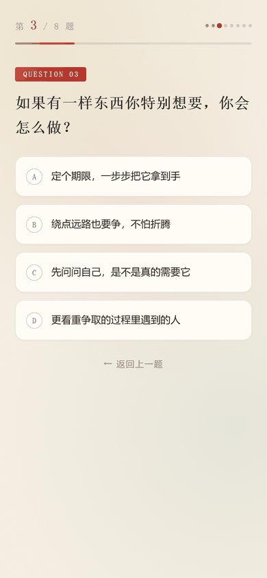
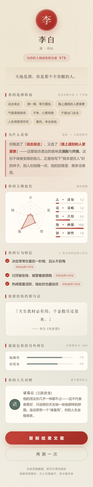
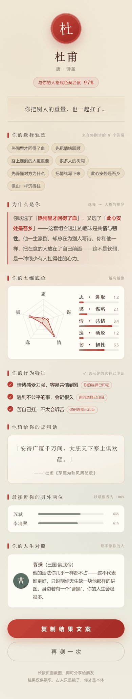

# 你是哪位古人 · 八题鉴心

> 一个国风人格测试 H5。8 道题，五维人格向量，测出你与 11 位古人中的哪一位最像。

**单文件 · 零依赖 · 可离线 · 双击即开**

🔗 **在线体验**：<https://1873402746.github.io/guofeng-identity-h5/>

---

## 预览

| 封面 | 答题 | 结果页 |
|:---:|:---:|:---:|
|  |  |  |

<details>
<summary>展开查看另外两位古人的结果页</summary>

| 武则天 | 杜甫 |
|:---:|:---:|
|  |  |

</details>

---

## 为什么结果"像你"——评价与所选题目高度对应

普通测试只给你一个结论，这个项目做了四层**选择回显**，让每句评价都能倒推到你的原始作答：

| 机制 | 说明 |
|---|---|
| **① 选择轨迹** | 把你 8 道题的原始选项标签逐条列出，不是泛泛的性格描述 |
| **② 为什么是你** | 算法定位你得分最高的两维，反查你**具体选了哪两项**，把原文嵌进推导句 |
| **③ 行为特征印证** | 你的选择印证过的特征自动盖上「你的选择已印证」徽章，未印证的标为「潜在倾向」 |
| **④ 五维雷达同框** | 你的分数与该古人的标准指纹在同一张雷达图上对比，差距一目了然 |

推导句示例（真实拼接，非模板套词）：

> 你既选了 **说走就走**，又选了 **路上遇到的人更重要**——透出的底味是洒脱与共情。这正是李白的人格外显相。

---

## 五维人格模型

| 维度 | 含义 |
|---|---|
| **志** | 进取心与目标感 |
| **谋** | 谋略与思辨 |
| **情** | 共情与情感浓度 |
| **逸** | 洒脱与自由意志 |
| **韧** | 坚韧与承压 |

11 位古人覆盖了这套模型的主要人格象限：

**李白 · 杜甫 · 诸葛亮 · 曹操 · 苏轼 · 李清照 · 陶渊明 · 庄子 · 王阳明 · 武则天 · 徐霞客**

---

## 算法：先让答案"答得出来"，再让结果"分得开"

这是本项目最花功夫的部分，也是踩过的坑。

### 问题：手写人格指纹往往是"不可达"的

直觉做法是给每位古人手写一个五维指纹，然后拿用户向量去比。但 8 题 × 4 选项能到达的评分空间**远小于**五维超立方体——因为你只能一分一分地加，**某一维顶满时其余维度必然被压低**。

实测结果：手写指纹的答题回捞率只有 **42–45%**，即一半以上的古人**用户根本答不出来**。

### 解法：反着做——从可达空间里"长出"指纹

```
枚举全部 4^8 = 65,536 种作答组合
   ↓ 计算每种组合的五维得分向量
   ↓ 按每个人物的性格签名过滤（哪两维必须最高、哪一维必须垫底）
   ↓ 在合格候选池内，用意图向量做相似度收窄
   ↓ 最后做最大最小距离分散，避免两个古人长得几乎一样
得到 11 个「天生可达」且互相可分的指纹
```

### 匹配算法：皮尔逊相关（4 种方案横向实测后选定）

同一个用户的向量，分别用余弦相似度、z-score 标准化欧氏距离、L2 欧氏距离、皮尔逊相关去匹配，用「模拟真实用户」（围绕某古人人格作答）评测：

| 指标 | 皮尔逊相关 |
|---|---|
| 原型自洽（指纹回灌命中） | **11 / 11** |
| 随机作答极差比（流行度均衡度） | **4.0×** |
| 指纹间最小距离 | **3.59** |
| 模拟用户 top-1 命中 | **64 / 53 / 41%**（三档一致性强度） |
| 模拟用户 top-3 命中 | **95 / 86 / 76%** |
| 指纹与人物性格忠实度 | **0.932** |

**选皮尔逊的原因**：它比的是**形状**而不是**距离**。用户画像普遍偏"平"（每题只加一两分），欧氏距离会被整体能量差异主导，而皮尔逊做均值中心化后只看走势，正好匹配"哪几维相对更高"这个真正的判别问题。

### 参数扫描

对「忠实度阈值」做了网格扫描（0.84 / 0.86 / 0.88 / 0.90），**0.88 是最佳操作点**：再高则候选池被性格约束锁死、人物之间区分度下降；再低则允许指纹过度偏离人物真实性格，导致结果页文案自相矛盾。

---

## 质量保障

- **28 项 DOM 桩断言**：用轻量 DOM 桩把整个 H5 脚本跑起来，模拟点击作答，验证 11 位古人全部可达、指纹回灌 11/11 命中、契合度落在 82–97%、选择轨迹与用户实际作答逐条对应。
- **真机截图目检**：Chrome 移动端仿真（390×844）逐页分段截图人工验收。
  > 这一步抓到一个 DOM 测试**测不出来**的真 bug：结果页渲染时忘记隐藏封面，导致两屏叠加。纯逻辑测试全绿也发现不了——肉眼验收不可省。

---

## 本地运行

无需构建、无需安装任何依赖：

```bash
git clone https://github.com/1873402746/guofeng-identity-h5.git
cd guofeng-identity-h5
# 直接用浏览器打开 index.html 即可
```

也可以起个本地静态服务：

```bash
python -m http.server 8000
# 访问 http://localhost:8000
```

---

## 文件结构

```
guofeng-identity-h5/
├── index.html          # 完整应用（HTML + CSS + JS 全部内联，约 48 KB）
├── screenshots/        # README 展示用预览图
└── README.md
```

`index.html` **零外部请求**：没有 CDN、没有字体外链、没有图片文件，所有图形（雷达图、印章）都是内联 SVG / CSS 绘制。断网也能完整运行，可直接拷进任何静态托管。

---

## 技术说明

- 纯原生 JS，无框架、无构建步骤
- 雷达图为手写内联 SVG
- 结果页支持一键生成分享文案
- 适配移动端，`viewport-fit=cover` 处理刘海屏安全区

---

## License

MIT
